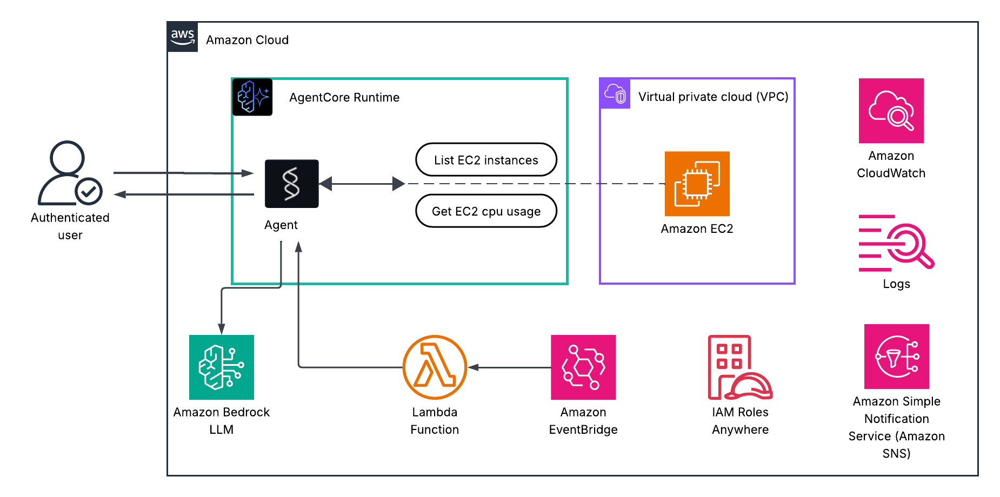

# Intelligent EC2 CPU Monitoring Agent

> AI-powered monitoring solution that provides intelligent, context-aware alerts for EC2 CPU usage using Claude LLM. Scale it based on your needs.



## 🎯 What Makes This Different

**Traditional CloudWatch Alarm:**
```
CPU is 87% on instance i-0abc123
```

**This Agent:**
```
CPU is 87% on web-server-prod due to traffic spike from marketing campaign.
This is expected behavior. Application is healthy with no errors.
Recommendation: Monitor for 10 minutes. Scale to t3.large if sustained >90%.
```

## ✨ Features

- 🤖 **AI-Powered Analysis**: Uses Claude LLM for intelligent monitoring
- 📊 **Real-time Monitoring**: Tracks CPU usage across all EC2 instances
- 🔔 **Smart Alerts**: Context-aware SNS notifications with recommendations
- 💬 **Natural Language**: Ask questions like "why is CPU high?"

## 🚀 Quick Start

### Prerequisites

- Python 3.12+
- AWS Account with EC2, CloudWatch, SNS access
- AgentCore CLI installed
- AWS CLI configured with credentials

### Installation

```bash
# Clone the repository
git clone https://github.com/sree7k7/intelligent-ec2-monitoring-agent.git
cd intelligent-ec2-monitoring-agent


python3 -m venv .venv # create virtual environment
source .venv/bin/activate # activate the environment

# Install dependencies
pip install -r requirements.txt

# Configure
# Edit config.py with your SNS topic ARN and settings. And mention the values.
```

### Configuration

```python
# config.py
SNS_TOPIC_ARN = "arn:aws:sns:us-east-1:123456789012:ops-alerts" # created manually
CPU_THRESHOLD = 80.0
ALERT_COOLDOWN_MINUTES = 15
```

### Deployment

```bash
# Deploy the infra and agent
sh deploy.sh

# clean
sh clean.sh

# update the agent or infra
sh deploy.sh true

# you can deploy updates using 
cdk deploy
agentcore launch

```

> Agent role requires CloudWatch, SNS, and EC2 permissions. For now, add PowerUserAccess.

### Interactive Queries

```bash
# List instances
python ask.py "list instances with cpu"

# Analyze high CPU
python ask.py "why is cpu high on i-03254281d159efc53"

# Get recommendations
python ask.py "should I scale up my instances"

# Check status
python ask.py "are all instances healthy"
```

### Automated Monitoring

Setup EventBridge to trigger the agent every 5 minutes:

1. Create EventBridge rule with schedule: `rate(5 minutes)`
2. Target: AgentCore Runtime endpoint
3. Payload: `{"prompt": "Check all instances for high CPU and send alerts if needed"}`

The agent will automatically:
- Check CPU for all instances
- Send SNS alerts when CPU > threshold
- Provide context and recommendations
- Prevent duplicate alerts (15-min cooldown)

## Architecture

```
EventBridge (5 min) → lambda → AgentCore Runtime → Claude LLM Agent
                                              ↓
                                      CloudWatch Metrics
                                              ↓
                                      Analysis & Context
                                              ↓
                                      SNS Alerts → Email/SMS
```

### Components

- **Agent**: Claude-powered analysis engine
- **Tools**: CloudWatch metrics, SNS publishing, instance monitoring
- **CLI**: Interactive and quick-check scripts
- **Configuration**: Simple config file

## 📁 Project Structure

```
intelligent-ec2-monitoring-agent/
├── README.md
├── agent.py
├── app.py
├── ask.py
├── clean.sh
├── config.py
├── deploy.sh
├── infrastructure
│   ├── cdk.out
│   └── infra_stack.py
├── lambda
│   └── agent_trigger.py
├── requirements.txt
├── response.json
└── tools
    ├── cloudwatch_tool.py
    ├── list_instances_tool.py
    ├── monitoring_tool.py
    └── sns_tool.py
```


### Example 2: Investigate High CPU
```bash
$ python ask.py "why is cpu high on i-03254281d159efc53"

CPU is 87% on app-server-prod due to traffic spike from marketing campaign.

Analysis:
- Pattern: Gradual increase over 15 minutes
- Application: Healthy, no errors detected
- Traffic: +45% increase in requests
- Time: 10 AM (peak business hours)

This is expected behavior. Application is handling load correctly.

Recommendation:
Monitor for 10 more minutes. Scale to t3.large if CPU sustains >90%.
Current t3.small can handle short-term spikes.
```

### Example 3: Get Recommendations
```bash
$ python ask.py "should I scale up app-server-prod"

Based on current CPU (87%) and traffic patterns:

Recommendation: MONITOR (not scale yet)

Reasoning:
- CPU has been stable at 85-87% for 15 minutes
- No performance degradation detected
- Traffic spike is expected (marketing campaign)
- Current instance can handle this load

Action Plan:
1. Monitor for 10 more minutes
2. If CPU remains >85%, prepare to scale
3. If CPU exceeds 90%, scale to t3.large immediately

Estimated cost impact of scaling:
- Current: t3.small = $15/month
- Scaled: t3.large = $60/month
- Recommendation: Wait and monitor first
```

## 🛣️ Roadmap

### Current:
- ✅ CPU monitoring with intelligent alerts
- ✅ Natural language interface
- ✅ Automated monitoring via EventBridge
- ✅ Alert deduplication
### Future:
- ✅ Multi-instance monitoring
- ✅ Instance health checks
- ✅ Performance analysis
- ✅ Customizable alerts and recommendations
- ✅ Real-time monitoring dashboard
- ✅ Scalability and cost optimization

## 🤝 Contributing

Contributions are welcome! Please feel free to submit a Pull Request.

1. Fork the repository
2. Create your feature branch (`git checkout -b feature/AmazingFeature`)
3. Commit your changes (`git commit -m 'Add some AmazingFeature'`)
4. Push to the branch (`git push origin feature/AmazingFeature`)
5. Open a Pull Request


## 🙏 Acknowledgments

- Built with [Strands Agent Framework](https://github.com/awslabs/strands)
- Powered by [Claude (Anthropic)](https://www.anthropic.com/)
- Deployed with [AWS AgentCore](https://aws.amazon.com/bedrock/)


